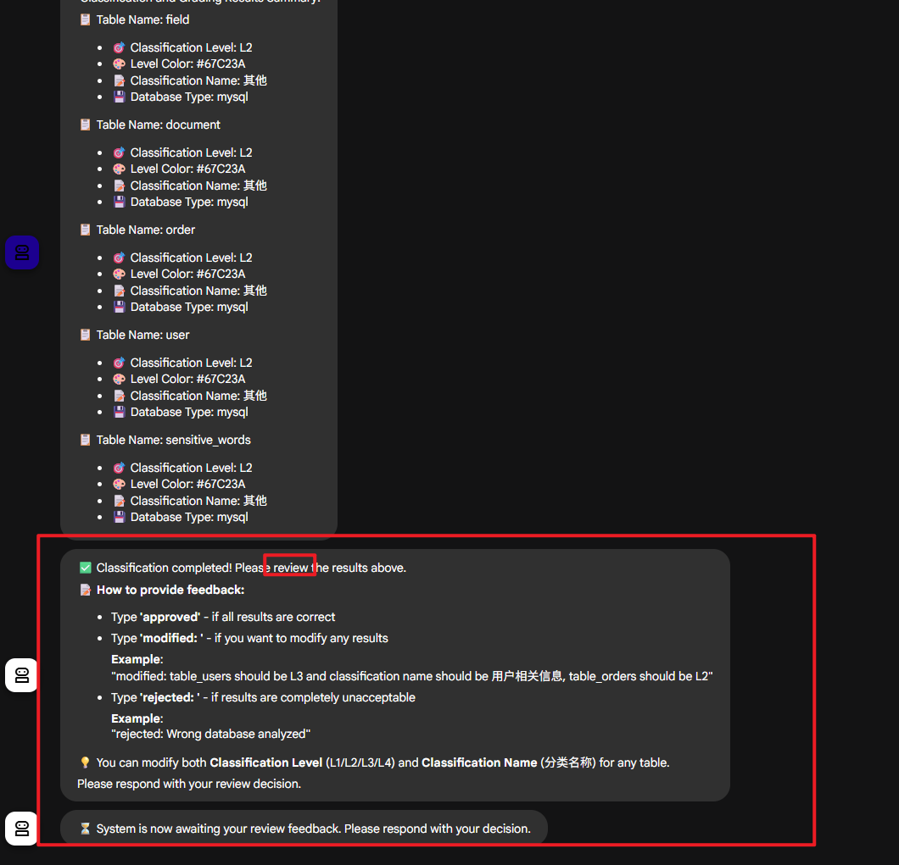
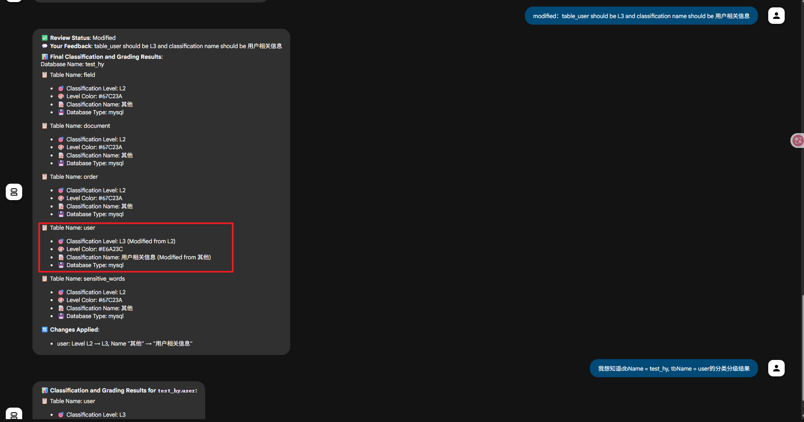

增加 human-in-the-loop pattern
- 基于对话的 HITL

- todo
  1. 字段级别的详情输出（add field detail mcp server）
  2. result通过摘要方式显示到前端， 完整的mcp server响应保存到state里， 方便后续的入库（review需修改两处）
  2. 将review完的结果， 通过mcp， 按结构化保存到数据库中